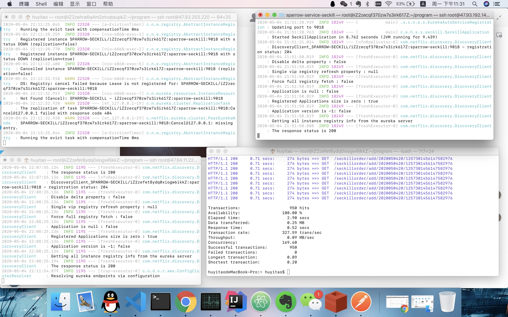

# 麻雀秒杀(SparrowSeckill)
>麻雀虽小，五脏俱全
### 概述

基于springBoot的秒杀商场系统

### 所用到的技术

srping boot,spring cloud,eureka,mysql

### 项目结构

* SparrowSeckill_common	        --->项目通用的一些工具与依赖
* SparrowSeckill_eureka	        --->注册中心
* SparrowSeckill_gateway	    --->网关
* SparrowSeckill_service	    --->微服务

### 项目关键技术点
1. 利用jwt实现用户鉴权
2. 使用redis实现秒杀商品预热，全程内存操作
3. 使用多线程实现异步下单功能
4. 使用MQ实现延时队列，实现库存回滚功能

### 测试结果
单机qps优化后最高到169

